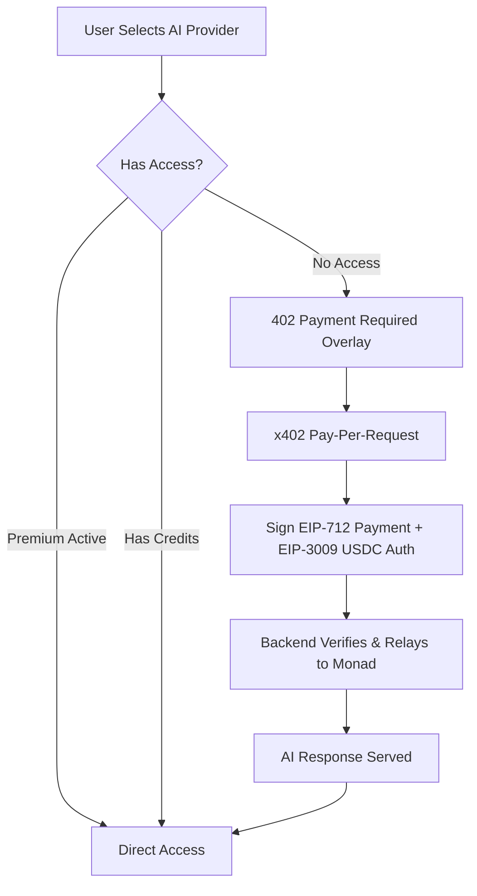

# x402 AI Access Marketplace

**Wallet-Native AI Monetization on Monad Blockchain**

> Payment = Permission | No Accounts Required | x402 Protocol | Gasless USDC Payments

---

## 🎯 What is This?

A hackathon MVP demonstrating how AI services can be monetized using the **x402 pattern** on **Monad blockchain**. Instead of traditional subscriptions, users pay per-request directly from their wallet—the payment itself acts as authorization.

## ✨ Key Features

- **x402 Pay-Per-Request**: Stateless, wallet-native payments using the x402 pattern.
- **Gasless UX**: Users authorize USDC transfers via EIP-3009; the backend relays the transaction, so users don't need MON for gas.
- **AI Providers Overlay**: Demonstrates integration with OpenAI, Gemini, Claude, and Perplexity (Mocked for Demo).
- **Flexible Access Modes**:
  - 👑 **Premium**: Time-based unlimited access (7 or 30 days).
  - 🎫 **Credit Packs**: Prepaid credits for flexible consumption.
  - ⚡ **Pay-Per-Request**: Pay only for what you use, instantly.
- **Modern UI**: High-fidelity glassmorphism design with real-time status tracking for credits and subscriptions.

## 🏗️ Architecture



## 🛠️ Tech Stack

- **Frontend**: React 18, Vite, Wagmi v2, RainbowKit, ethers.js
- **Backend**: Node.js, Express, ethers.js
- **Smart Contracts**: Solidity 0.8.20, Foundry
- **Standards**: EIP-712 (Typed Signatures), EIP-3009 (USDC Transfer with Authorization)
- **Network**: Monad Testnet (Chain ID: 10143)

## 🚀 Quick Start

### 1. Prerequisites

- Node.js 18+
- [MetaMask](https://metamask.io/) or any EIP-1193 wallet
- Monad Testnet tokens (from [faucet.monad.xyz](https://faucet.monad.xyz))
- USDC tokens on Monad Testnet (for x402 payments)

### 2. Installation

```bash
# Clone the repository
git clone https://github.com/KartikMantri/pay-per-request-x402.git
cd pay-per-request-x402

# Install backend dependencies
cd backend
npm install
cp .env.example .env

# Install frontend dependencies
cd ../frontend
npm install
```

### 3. Production Configuration

Update `backend/.env` with your credentials:

```env
RELAYER_PRIVATE_KEY=your_wallet_private_key # To pay gas for relayer operations
X402_PROCESSOR_ADDRESS=0x5ED6...             # Current deployed processor
USDC_CONTRACT_ADDRESS=0x534b...              # USDC on Monad Testnet
X402_RECEIVER_ADDRESS=your_wallet_address    # Where you receive payments
```

### 4. Running Locally

```bash
# Terminal 1: Backend
cd backend
npm run dev

# Terminal 2: Frontend
cd frontend
npm run dev
```

Open [http://localhost:5173](http://localhost:5173) to start using the marketplace.

## 📁 Project Structure

```
├── contracts/           # Solidity smart contracts
│   ├── src/             # AIAccessMarketplace & X402Processor
│   └── script/          # Deployment scripts
├── backend/             # Express.js API Gateway
│   ├── src/routes/      # AI request handling
│   └── src/services/    # x402 processor & blockchain services
└── frontend/            # React + Vite UI
    ├── src/components/  # High-fidelity UI components
    └── src/hooks/       # Custom Web3 & AI hooks
```

## 🔐 x402 Protocol Flow

1. **Request**: User sends a prompt to `/api/ai/generate`.
2. **402 Challenge**: Server detects no access and returns `402 Payment Required` with EIP-712 data.
3. **Authorization**: User signs a payment request and a USDC transfer authorization.
4. **Processing**: Backend verifies the signature on-chain and triggers the AI generation.
5. **Fulfillment**: Validated AI response (Mocked) is sent back to the user.

## 📊 Track Alignment

| Track     | Implementation                                                                |
| --------- | ----------------------------------------------------------------------------- |
| **x402**  | Genuine HTTP 402 protocol usage with wallet-native signatures.                |
| **Monad** | Leveraging Monad's high speed and low cost for micro-transaction feasibility. |
| **DeFi**  | On-chain access control and gasless USDC transactions.                        |

## ⚠️ Demo Notes

- **AI Providers**: All responses are generated by a mock service for demonstration purposes. No real AI API keys are required to explore the payment flow.
- **Statelessness**: The x402 flow demonstrates how payment acts as the sole permission required for access.

## 📜 License

MIT
